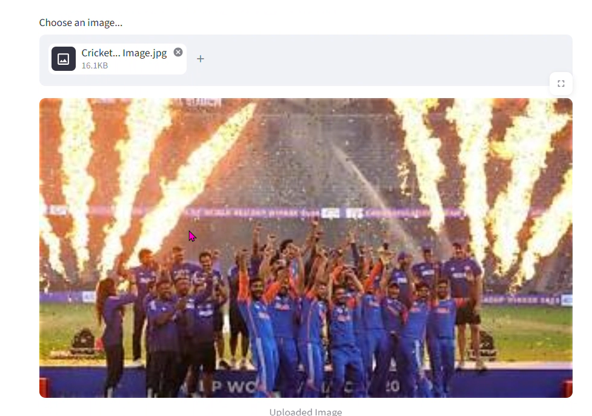
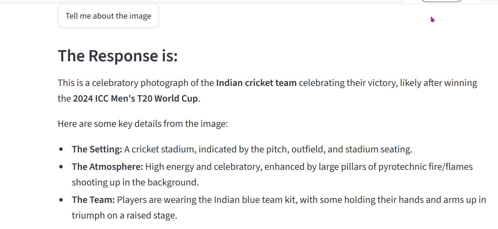

# 🤖 Gemini AI Project

A comprehensive **Generative AI** project built using **Google Gemini API**. This repository demonstrates multiple AI applications including:

- 💬 AI Chatbot
- 📄 Question Answering over Documents
- 🖼️ Image Understanding (Vision AI)
- 🌐 General AI Assistant

---

# 🚀 Features

- Gemini Pro Chatbot
- Question Answering (QA Chat)
- Vision AI (Image Analysis)
- Interactive Python Applications
- Easy to Run
- Beginner Friendly

---

# 🛠️ Technologies Used

- Python
- Google Gemini API
- Generative AI
- Pillow (PIL)
- Markdown
- GitHub

---

# 📂 Project Structure

```
Gemini-AI-Project/
│
├── Images/
│   ├── Cricket Tropy Image.jpg
│   └── Universe Image.jpg
│
├── Output/
│   ├── App OUTPUT.png
│   ├── Chat Output.png
│   ├── QACHAT Output.png
│   ├── Vision1.png
│   └── Vision2.png
│
├── app.py
├── chat.py
├── qachat.py
├── vision.py
├── Gemini_Intro.ipynb
└── README.md
```

---

# ⚙️ Installation

Clone the repository

```bash
git clone https://github.com/shendgeankita522-blip/Gemini-AI-Project.git
```

Move into the project

```bash
cd Gemini-AI-Project
```

Install dependencies

```bash
pip install -r requirements.txt
```

---

# ▶️ Run

### Chatbot

```bash
python chat.py
```

### Question Answering

```bash
python qachat.py
```

### Vision AI

```bash
python vision.py
```

### Main Application

```bash
python app.py
```

---

# 🖼️ Input Images

### Cricket Trophy


---

### Universe


---

# 📸 Output Images

### Application Output


---

### Chat Output


---

### QA Chat Output


---

### Vision Output 1



---

### Vision Output 2



---

# 📌 Future Improvements

- Voice Chat
- PDF Chatbot
- Image Generation
- Multi-language Support
- Streamlit UI
- Deployment on Hugging Face Spaces

---

# 👩‍💻 Author

**Ankita Shendge**

GitHub:
https://github.com/shendgeankita522-blip

LinkedIn:
https://www.linkedin.com/in/ankita-shendge

---

⭐ If you like this project, don't forget to **Star** the repository!
